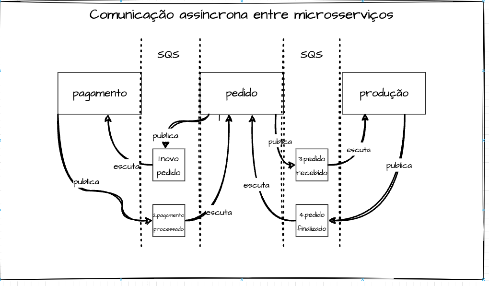

<h1 align="center">
    Hexafood
</h1>


## Índice

- <a href="#boat-sobre-o-projeto">Sobre o projeto</a>
- <a href="#hammer-tecnologias">Tecnologias</a>
- <a href="#rocket-como-rodar-esse-projeto">Como rodar esse projeto</a>
- <a href="#electric_plug-infraestrutura-k8s">Infraestrutura K8S</a>
- <a href="#open_file_folder-clean-architecture-na-pratica">Clean Architecture na prática</a>
- <a href="#notebook-lógica-de-negócio-domínio-aplicada">Lógica de negócio (domínio) aplicada</a>
    - <a href="#identificação">Identificação</a>
    - <a href="#pedido">Pedido</a>
    - <a href="#pagamento">Pagamento</a>
- <a href="#bookmark_tabs-licença">Licença</a>
- <a href="#wink-autores">Autores</a>
## :boat: Sobre o projeto

Esse projeto faz parte do trabalho "Tech Challenge - Fase 03", ministrado no segundo módulo do curso de Pós Graduação Software Architecture da FIAP em parceria com a Alura.

Para exercitar os conceitos apresentados nas matérias do curso, sendo elas sobre Testes e Microserviços, a aplicação backend desenovlvida em Typescript no framework NestJS, foi adaptada a fim de representar os conceitos da Arquitetura Limpa, e também foi criado scripts de configuração de um cluster kubernetes.

## :hammer: Tecnologias:

- **[Typescript](https://www.typescriptlang.org)**
- **[NestJS](https://nestjs.com/)**
- **[JestJS](https://jestjs.io/pt-BR/)**

## :rocket: Como rodar esse projeto

Se você estiver usando Windows, vai precisar do WSL para rodar esse projeto de forma prática. Para isso, você pode instalá-lo seguindo o seguinte [tutorial](https://learn.microsoft.com/pt-br/windows/wsl/install). Também será necessário uma distribuição linux para utilizar o WSL. Recomendo o Ubuntu que pode ser baixando na própria Microsoft Store no [link](https://apps.microsoft.com/store/detail/ubuntu/9PDXGNCFSCZV).
Depois, vai precisar do Docker, o qual a versão de Windows pode ser encontrada [aqui](https://docs.docker.com/desktop/install/windows-install/).
Então, clone o projeto dentro do WSL, vá para pasta dele e execute o comando:

```
docker compose build --no-cache
```

Após a construção da imagem, basta executar o comando:

```
docker compose up
```

O projeto estará executando no endereço http://localhost:3000/.

Para limpar o volume db do docker, execute o comando:

```
docker-compose down -v
```
## :electric_plug: Sobre o microserviço produção
Este é um microserviço desenvolvido com NestJS que tem como objetivo atualizar os dados de um pedido proveniente de um sistema de pedidos, através de mensageria SQS da AWS. Quando recebe uma mensagem indicando que um pedido foi recebido (pedido.recebido), este microserviço cria um registro do pedido no banco de dados da AWS DynamoDB. Ele então gerencia o status do pedido, atualizando-o para os estágios de "preparando" e "preparação finalizada". Além disso, ele envia uma mensagem para o microserviço de pedidos, informando que o pedido está pronto para ser retirado.

Funcionalidades
Recebe mensagens da fila SQS indicando que um pedido foi recebido.
Cria um registro do pedido no banco de dados DynamoDB da AWS.
Atualiza o status do pedido para "preparando" e "preparação finalizada".
Envia uma mensagem para o microserviço de pedidos informando que o pedido está pronto para ser retirado.

## 🌉 Modelagem do

<p align="center">
    
</p>

## :bookmark_tabs: Licença

Este projeto esta sobe a licença MIT. Veja a [LICENÇA](https://opensource.org/licenses/MIT) para saber mais.

## :wink: Autores

Feito com ❤️ por:

- [Bruno Padilha](https://www.linkedin.com/in/brpadilha/)
- [Lucas Siqueira](https://www.linkedin.com/in/lucassouzatidev/)
- [Marayza](https://www.linkedin.com/in/marayza-gonzaga-7766251b1/)

[Voltar ao topo](#índice)