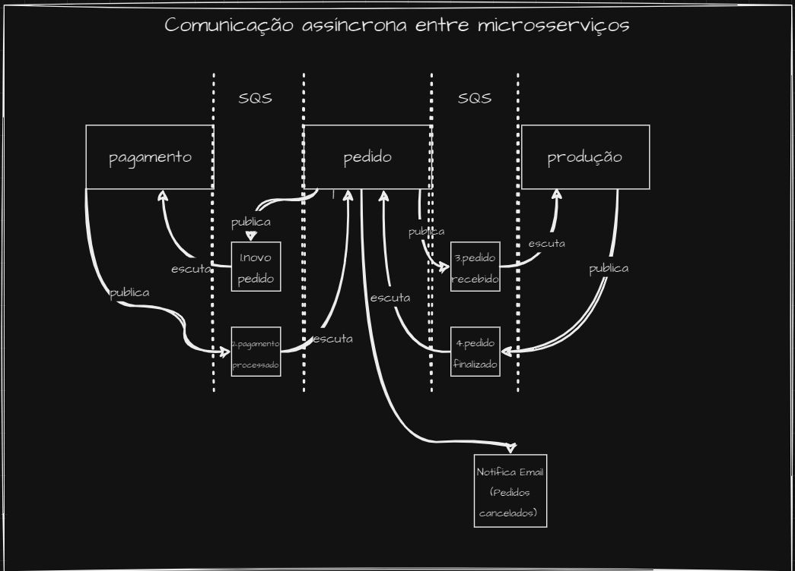

<h1 align="center">
    Hexafood
</h1>


## Índice

- <a href="#boat-sobre-o-projeto">Sobre o projeto</a>
- <a href="#hammer-tecnologias">Tecnologias</a>
- <a href="#rocket-como-rodar-esse-projeto">Como rodar esse projeto</a>
- <a href="#electric_plug-infraestrutura-k8s">Infraestrutura K8S</a>
- <a href="#open_file_folder-clean-architecture-na-pratica">Clean Architecture na prática</a>
- <a href="#notebook-lógica-de-negócio-domínio-aplicada">Lógica de negócio (domínio) aplicada</a>
    - <a href="#identificação">Identificação</a>
    - <a href="#pedido">Pedido</a>
    - <a href="#pagamento">Pagamento</a>
- <a href="#bookmark_tabs-licença">Licença</a>
- <a href="#wink-autores">Autores</a>
## :boat: Sobre o projeto

Esse projeto faz parte do trabalho "Tech Challenge - Fase 03", ministrado no segundo módulo do curso de Pós Graduação Software Architecture da FIAP em parceria com a Alura.

Para exercitar os conceitos apresentados nas matérias do curso, sendo elas sobre Testes e Microserviços, a aplicação backend desenovlvida em Typescript no framework NestJS, foi adaptada a fim de representar os conceitos da Arquitetura Limpa, e também foi criado scripts de configuração de um cluster kubernetes.

## :hammer: Tecnologias:

- **[Typescript](https://www.typescriptlang.org)**
- **[NestJS](https://nestjs.com/)**
- **[JestJS](https://jestjs.io/pt-BR/)**

## :rocket: Como rodar esse projeto

Se você estiver usando Windows, vai precisar do WSL para rodar esse projeto de forma prática. Para isso, você pode instalá-lo seguindo o seguinte [tutorial](https://learn.microsoft.com/pt-br/windows/wsl/install). Também será necessário uma distribuição linux para utilizar o WSL. Recomendo o Ubuntu que pode ser baixando na própria Microsoft Store no [link](https://apps.microsoft.com/store/detail/ubuntu/9PDXGNCFSCZV).
Depois, vai precisar do Docker, o qual a versão de Windows pode ser encontrada [aqui](https://docs.docker.com/desktop/install/windows-install/).
Então, clone o projeto dentro do WSL, vá para pasta dele e execute o comando:

```
docker compose build --no-cache
```

Após a construção da imagem, basta executar o comando:

```
docker compose up
```

O projeto estará executando no endereço http://localhost:3000/.

Para limpar o volume db do docker, execute o comando:

```
docker-compose down -v
```
## :electric_plug: Sobre o microserviço produção
Este é um microserviço desenvolvido com NestJS que tem como objetivo atualizar os dados de um pedido proveniente de um sistema de pedidos, através de mensageria SQS da AWS. Quando recebe uma mensagem indicando que um pedido foi recebido (pedido.recebido), este microserviço cria um registro do pedido no banco de dados da AWS DynamoDB. Ele então gerencia o status do pedido, atualizando-o para os estágios de "preparando" e "preparação finalizada". Além disso, ele envia uma mensagem para o microserviço de pedidos, informando que o pedido está pronto para ser retirado.

Funcionalidades
Recebe mensagens da fila SQS indicando que um pedido foi recebido.
Cria um registro do pedido no banco de dados DynamoDB da AWS.
Atualiza o status do pedido para "preparando" e "preparação finalizada".
Envia uma mensagem para o microserviço de pedidos informando que o pedido está pronto para ser retirado.

## :open_file_folder: Utilizando Saga Coreografada na Arquitetura de Microserviços

Na arquitetura de microserviços da aplicação Hexafood, optamos por implementar o padrão de projeto Saga Coreografada para garantir a consistência das operações distribuídas entre os diferentes serviços.

### Motivação
<b>Coordenação Distribuída</b>

Ao lidar com transações que envolvem múltiplos serviços, é crucial garantir que todas as etapas sejam executadas com sucesso ou revertidas em caso de falha. A abordagem de Saga Coreografada permite uma coordenação distribuída entre os serviços participantes, eliminando a necessidade de um ponto centralizado de controle.

<b>Desacoplamento e Escalabilidade</b>

Cada microserviço na arquitetura do Hexafood é responsável por uma parte específica do fluxo de trabalho, tornando o sistema mais desacoplado e modular. Isso facilita a manutenção, evolução e escalabilidade da aplicação, pois cada serviço pode ser desenvolvido, testado e implantado de forma independente.

<b>Flexibilidade e Tolerância a Falhas</b>

Com a Saga Coreografada, cada serviço define suas próprias regras de compensação para desfazer as operações em caso de falha. Isso proporciona uma maior flexibilidade na gestão de exceções e na recuperação de falhas, tornando o sistema mais resiliente e robusto.

<b>Orquestração através de Eventos</b>

A troca de eventos entre os serviços é essencial para iniciar transações e coordenar suas ações. Os eventos são utilizados para comunicar mudanças de estado e acionar as próximas etapas do fluxo de trabalho. Essa abordagem baseada em eventos torna o sistema mais assíncrono e reativo às mudanças de contexto.


### Fluxo de Trabalho

hexafood-pedidos:<br>
Inicia o processo de solicitação de pedidos e coloca uma mensagem na fila "novo_pedido".

hexafood-pagamentos:<br>
Lê a mensagem da fila "novo_pedido", realiza a tentativa de pagamento e envia o resultado para a fila "pagamento_processado".

hexafood-pedidos:<br>
Lê a mensagem da fila "pagamento_processado" e, se o pagamento for bem-sucedido, envia uma mensagem para a fila "pedido_recebido".
Caso o pagamento não tenho sido completado com sucesso, ocorre uma ação compensatória onde o pedido é atualizado para o status "CANCELADO" e é enviado uma notificação por e-email para o cliente (caso o mesmo tenha e-mail cadastrado).
Se o cliente não tiver cadastro, o resultado do cancelamento é retornado em GET/PEDIDOS, onde um monitor no restaurante apresenta o status do pedidos dos clientes.

hexafood-producao:<br>
Lê a mensagem da fila "pedido_recebido" e inicia a preparação do pedido.
Ao finalizar, é enviado para a fila "pedido_finalizado", onde será lido pelo hexafood-pedidos, atualizando o status para FINALIZADO.

### Ação Compensatórias

A fim de atender aos princípios do padrão SAGA, é válido destacar duas implementações realizadas, que visaram acrescentar fluxo de ação compensatórias ao negócio.

Primeiramente, conforme mencionado, temos a situação onde um pagamento não foi aprovado. Nesse caso, como temos um cenário de exceção, o fluxo deve ser interrompido e o pedido deve ser cancelado. Então, o cenário feliz é interrompido e não é disparado um novo evento de "Pedido Recebido", conforme implementado no trecho de código abaixo:

```typescript
export class PagamentoProcessadoListener {
   
    ...

    @OnEvent('pagamento.processado')
    async handle(event: PagamentoProcessadoEvent) {
        const pagamento = event.pagamento;

        const pedido = await this.pedidosRepository.findByCodigo(pagamento.id_pedido);

        if (pagamento.status.toLowerCase() != 'aprovado') {
            pedido.status = StatusPedido.CANCELADO;
            this.eventEmitter.emit('pedido.cancelado', new PedidoCanceladoEvent(pedido));
        }
        else {
            pedido.status = StatusPedido.RECEBIDO;
        }

        try {
            await this.updatePedidoUseCase.execute(pedido);
            if (pedido.status == StatusPedido.RECEBIDO) {
                this.eventEmitter.emit('pedido.recebido', new PedidoRecebidoEvent(pedido));
            }
        } catch (error) {
            console.log(error);
        }
    }
}

```

Considerando que também em um cenário de integração entre microssserviços, existe a possibilidade de falhas que gerarem a inconsistência eventual de dados, então implementou-se  um fluxo para cancelar um pedido caso aconteça um erro ao tentar publicá-lo na fila SQS. 

```typescript
export class NovoPedidoListener {

    ...

    @OnEvent('novo.pedido')
    async handle(event: NovoPedidoEvent) {
        const pedido = event.pedido;

    ...

    await this.queueService.sendMessage(
      process.env.AWS_SQS_NOVO_PEDIDO_QUEUE_NAME,
      JSON.stringify(pedidoMessageDto),
      async (error) => {
          console.error("Falha ao enviar a mensagem:", error);
          pedido.status = StatusPedido.CANCELADO;

          try {
            await this.pedidoRepository.update(pedido.id, pedido);
            await this.notificarPedidoCanceladoUseCase.execute(pedido);
          } catch (error) {
            console.error("Falha ao atualizar o pedido:", error);
          }
        });
    }
}
```

Ou seja, em caso de problemas com comunicação com o SQS, o pedido tem o status mudado para CANCELADO e é acionado um novo fluxo para notificar ao cliente do ocorrido. Dessa forma, previni-se um cenário de inconsistência que poderia vir a correr de ter o pedido INICIADO, mas sem estar sendo processado pelo fluxo de microsserviços. 

Esse cenário pode ser melhorado futuramente, onde o pedido cancelado é publicado em um tópico, onde o microsserviço de pagamento também poderá atuar reembolsando o valor pago. 

### Conclusão
A Saga Coreografada é uma escolha adequada para a arquitetura de microserviços da Hexafood devido à sua coordenação distribuída, desacoplamento, flexibilidade e tolerância a falhas. Essa abordagem permite que cada serviço participe ativamente do fluxo de trabalho, garantindo a consistência das operações distribuídas em um ambiente altamente dinâmico e escalável.

<br>
<h4 align="center">
    
</h4>
<br>

## :bookmark_tabs: Licença

Este projeto esta sobe a licença MIT. Veja a [LICENÇA](https://opensource.org/licenses/MIT) para saber mais.

## :wink: Autores

Feito com ❤️ por:

- [Bruno Padilha](https://www.linkedin.com/in/brpadilha/)
- [Lucas Siqueira](https://www.linkedin.com/in/lucassouzatidev/)
- [Marayza](https://www.linkedin.com/in/marayza-gonzaga-7766251b1/)

[Voltar ao topo](#índice)